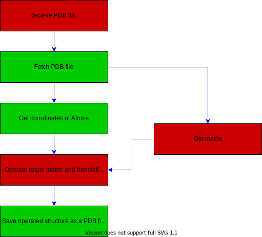

# 生物学的構造単位生成器

このREADMEやコード内ではsymmetry shiftと呼んでいます。

## PAY ATTENTION PLEASE

既存パッケージである`biopython`の中身を、そのパッケージのよさを失わないまま少しずつ機能を追加し、`biopython`の責務ではない部分を`symmetryshift`が吸収するという形で実装しました。ぜひ、symmetryshiftだけでなくbiopython([fork先](https://github.com/flat35hd99/biopython))もご確認ください。

また、行っていることは単純ですが、その意義、方法はわかりにくいと感じたため、このREADMEにできるだけ補足を記しました。

- [分子生物学的な前提知識](https://github.com/jphacks/D_2110#%E5%88%86%E5%AD%90%E7%94%9F%E7%89%A9%E5%AD%A6%E7%9A%84%E3%81%AA%E5%89%8D%E6%8F%90%E7%9F%A5%E8%AD%98)
- [製品説明](https://github.com/jphacks/D_2110#%E8%A3%BD%E5%93%81%E8%AA%AC%E6%98%8E%E5%85%B7%E4%BD%93%E7%9A%84%E3%81%AA%E8%A3%BD%E5%93%81%E3%81%AE%E8%AA%AC%E6%98%8E)

この二か所で特に詳しい説明を行っています。

[](https://youtu.be/-h38XeSu9sA)

## Quick install and use guide

Installation needs distributed biopython we modified.

```sh
pip install git+https://github.com/flat35hd99/biopython
pip install symmetryshift
```

and then, simply

```sh
symmetry 1KZU # Argument is pdb id.
```

Please check the `out.pdb` on your structure viewer and compare between `out.pdb` and `kz/pdb1kzu.ent`.(The latter is pdb file downloaded by biopython.)

If you have not installed protein viewer

- PyMOL
  - We used it in demo and demo movie.
  - Download installer from [official page](https://pymol.org/2/), run installer, and run `pymol`. `pymol` command launch GUI. Drug and drop pdb file and you can see a pdb file structure.
- VMD
  - need smaller disk space than PyMOL
  - [VMDの使い方の基本 (Mac)](https://oosakik.hatenablog.com/entry/2019/11/10/VMD%E3%81%AE%E4%BD%BF%E3%81%84%E6%96%B9_%E3%82%92%E5%88%9D%E5%BF%83%E8%80%85%E3%81%AB%E3%82%82%E3%82%8F%E3%81%8B%E3%82%8A%E3%82%84%E3%81%99%E3%81%8F_%28Mac%29) (windowsも同様) is helpful to instal and view pdb file.

## 製品概要
### 背景(製品開発のきっかけ、課題等）

PDBファイルという生物学・生化学分野における、タンパク質の結晶構造を記すデファクトスタンダードなファイル形式が存在する。

このファイルは、

1. X線結晶構造解析やクライオ電顕などでタンパク質の結晶構造が解明され論文化されるとき、ほぼ確実に作成・公開される。
2. 分子動力学シミュレーションはこのデータをもとにシミュレーションを行う。
3. その他立体構造の解析では必ず利用されるといっても過言ではない。

PDBファイルは解析におけるほぼすべての情報を保持できるという強力な特性があるが、それゆえファイルサイズは肥大化しがちである。

そのため、回転対称性・並進対称性が構造内に存在する場合には、その対称性を利用してファイルサイズを節約する戦略が取られる。すなわち、回転対称性のある原子群（正確には主鎖ごと）について、単位（ユニット）になる原子の座標のみを記録しておき、残りの原子はどのように回転・並進させれば座標を再現できるか記すのである。

このようにして、生物学的構造単位（生物学的に意味のある分子集団）を再現する。

### 分子生物学的な前提知識
背景でも述べたように、PDB (Protein Data Bank) ファイルには、以下のように単位構造にある全原子の座標が記載されてある。枠で囲ってある部分は、左から原子のx座標、y座標、z座標である。


pdbファイルは、主にatom, structure, chain で構成されていて、biopythonパッケージがこれらの情報を活用している。

PDBファイルには単位構造のデータのみしか記載されていないため、すべての構造データを一度に得ることができない。


そこで、我々はPDBファイルの中にコメントとして本来の構造に関する記述があることを用いて、原子の座標を対称操作することにした。


これは BIOMT1 から BIOMT3 までが一つのセットになっており、青枠で囲った部分が回転行列で、黄色の枠で囲った部分が並進ベクトルである。
緑色の枠は、回転行列の部分は単位行列、並進ベクトル部は零ベクトルとなっている。すなわち、このPDBファイルに記載されている単位構造そのものを表している。

この回転行列と並進ベクトルを元の座標に作用させることにより、対称操作した後の座標が得られる。

つまり、ある原子の元の座標を 
、回転行列を 、並進ベクトルを  とすると、対称操作した後の原子の座標 
は、次のように表すことができる。


この演算を原子1つ1つに、必要な対称操作の数だけ行う。

### 製品説明（具体的な製品の説明）

本プロダクトは、この回転・並進の作業をほぼ全てのPDBファイルに対して自動化する。

具体的な説明を行う。以下は開発した生物学的構造単位生成器、もとい **symmetry shift** のワークフロー図である。赤色が今回私たちが開発、または、機能追加した箇所である。黄緑（緑系）で示した箇所は`Bio.PDP`パッケージがあらかじめ備えていた機能である。



ユーザーは生物学的構造単位（生物学的に意味のある構造）を取得したいPDB IDをCLI、またはPythonのパッケージの引数として指定する。これ以上のユーザーからのインプットはない。すべてsymmetry shift内で完結する。

```sh
symmetry 5V8K # PDB ID is 5V8K
```

パッケージとして利用する場合:

```python
from symmetryshift.create_biological_structure_unit import create, save

pdb_id = "5V8K"
new_structure = create(pdb_id)
save(new_structure)
```

symmetry shiftは`sys.argv`で受け取ったPDB IDを`Bio.PDB`を用いて無償公開データサーバーからPDB fileを取得する。(**Recieve PDB ID**)

次にheaderの解析(**Get matrix**)と全原子の座標を取得(**Get coordinates of Atoms**)する。全原子の座標取得については特に手を加えていないので、ここではheaderの解析について説明する。

PDB fileにはヘッダー行と呼ばれる領域が存在しており、そこに決まった形式で回転行列と並進ベクトルが記述されている。(詳しくはhogehoge参照)

biopythonはヘッダーの一部を解析する`Bio.PDB.parse_pdb_header`モジュールが存在したため、これに独立して機能を追加する方法を採った。これは一つのcommitにまとめたので、[c4aae6f71c9929f1f500e8c368482bc6c1d33d34](https://github.com/flat35hd99/biopython/commit/c4aae6f71c9929f1f500e8c368482bc6c1d33d34#diff-489f4c709ac8e95f3002171793e65a4f5339a5ab137480d278b6b50f6a4dfb76)を参照いただきたい。簡潔に述べると

- 既存データストア(`pdbh_dict`)に新しく`chain_ids_to_work_symmetry_operator`と`symmetry_operator`を追加し、これに保存するようにした。
- 一番初めの単位行列はいつも[[1,0,0],[0,1,0],[0,0,1]]なので、取得しないことにした。
- 取得したいデータは行頭が`REMARK 350`であるため、ヒットしたときにデータをいい感じに取得してデータストアに保存するようにした。
  - 複雑なデータ型になってしまったので、コメントで補足した。

以上のように実装した。この箇所はbiopythonに単純に機能追加しても、biopythonの良さであるシンプル・独立な実装は失われないと判断したので、biopython内で実装した。

次に取得した回転行列と並進ベクトルを作用させる箇所(**Operate rotate matrix and translation vector to coordinates**)の説明に移る。

ここまでで必要なデータは全て取得できたので、演算のパートになる。

ここに一つ工夫ポイントがある。[分子生物学的な前提知識](https://github.com/jphacks/D_2110#%E5%88%86%E5%AD%90%E7%94%9F%E7%89%A9%E5%AD%A6%E7%9A%84%E3%81%AA%E5%89%8D%E6%8F%90%E7%9F%A5%E8%AD%98)に記したように、演算は全原子に対して


このように演算を行う。しかし私たちは`chain`という`atom`の集団に対してこの演算を行った。

- 一つの原子に対してのみ演算を行うことは少ない。
- PDBデータには座標以外にも、電荷、熱揺らぎなどが記録されている。しかし座標以外に和算・乗算を行って有意な情報を得られる量はない。

以上の理由から、`Bio.PDB.Chain`の`__mul__()`と`__add__()`をオーバーライドする戦略を採った。そういうわけで実際の演算は以下に示すように非常にエレガントに行われる。(`/symmetryshift/symmetryshift/create_biological_structure_unit.py`の76行あたり参照)

```python
new_chain = chain * operator["matrix"] + operator["shift"]
```

これで演算が完了した。

最後に保存する(**Save operated structure as a PDB file**)が、これは`Bio.PDB.PDBIO`の機能をそのまま利用した。

### 特長

- biopython.PDBという既存OSSを全面的に利用、また、内部の演算子をオーバーライドするなどの簡単な処理を行った。biopythonは情報の提供を責務として開発されているため、今回の対称性から原子座標を計算することは責務の範囲外にあたる。この切り分けを行った。
- 確認できるすべてのファイルに対して正常に動作する。zero configuration.

### 解決出来ること

- PDB idを入れればやってくれるので、今後回転対称性・並進対称性を使って新しくPDBファイルを作る作業はやらなくてよくなる。すなわち、全ての生化学分野のアカデミアンの時間を節約する。
- Pythonのパッケージとして`Bio.PDB.Structure`を返すことも可能なので、その後ユーザーが好きなように編集可能。

### 今後の展望

- PDBファイルは厳格なフォーマットに基づくため、chain name/idが52個しか指定できない。それ以上生成することになるときは途中まで生成して、52個よりも先は生成せず終了しているが、これはあんまりいい実装じゃない。改善したい。
- JPHACKSがひと段落したらOSSとして整備する予定なので、ドキュメントをいい感じに英語で書きたい。
- **コミットを整理してbiopythonにPRを送る。**

### 注力したこと（こだわり等）

* biopythonが解決すべきことかしないことかを考えた。
  * 実装すべきかどうかも考えた。
  * 実装すべきものは今後の本家へのPRも考慮して、（忙しくないときは）コミットメッセージをわかりやすく書いた。
* biopythonが解決すべきだと判断したときは、biopythonのユーザーが純粋に使いやすくなるように考慮して実装した。
* 自分たちのやりたかったことはその延長線上にあるようにした。

## 開発技術

PDBファイルから生物学的構造単位を生成、保存すること。

#### API・データ
* Protein Data Bank

#### フレームワーク・ライブラリ・モジュール
* [biopython(本家)](https://github.com/biopython/biopython) (forkは[こちら](https://github.com/flat35hd99/biopython))
* 発表、動画、説明の画像には[PyMOL](https://pymol.org/2/)を利用した。

### 独自技術
#### ハッカソンで開発した独自機能・技術

[製品説明](https://github.com/jphacks/D_2110#%E8%A3%BD%E5%93%81%E8%AA%AC%E6%98%8E%E5%85%B7%E4%BD%93%E7%9A%84%E3%81%AA%E8%A3%BD%E5%93%81%E3%81%AE%E8%AA%AC%E6%98%8E)で行ってしまったため、簡潔に述べる。

* 回転・並進対称性のある結晶構造が記されたPDBファイルについて、これをPDBファイル内のヘッダーを解析・作用させ、生物学的構造単位を生成・保存する技術
* 既存パッケージ`biopython`の拡張

開発における注力ポイントを述べる。

- biopythonのシンプルさを殺さずにそれぞれの機能を小さく実装した。
- symmetryshiftは`biopython`が担うべきではない、演算を行う箇所を担当した。
- biopythonにやりたいことを詰め込むのではなく、symmetryshiftとして実装した。

#### 製品に取り入れた研究内容（データ・ソフトウェアなど）（※アカデミック部門の場合のみ提出必須）
* Protein Data Bank
* biopython

### 謝辞
* We appriciate for A. Kimura to give an assignment and teach how to read PDB files. 
